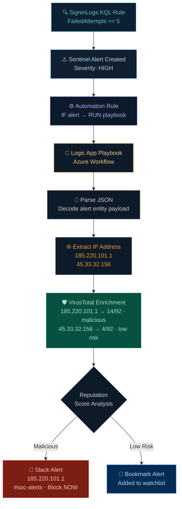

# Automated Threat Intelligence Enrichment & Response Workflow

## Project Overview

Security analysts often spend significant time manually validating suspicious IP addresses, checking threat intelligence platforms, and deciding whether an alert requires immediate action or can be safely deprioritized.

To reduce this manual workload, I built an automated SOAR workflow using Microsoft Sentinel, Microsoft Logic Apps, VirusTotal, and Slack.

The workflow automatically enriches suspicious IP addresses with threat intelligence data, evaluates malicious reputation scores, and performs automated response actions whenever a security alert is triggered.

---

# Key Outcomes

✅ Automated threat intelligence enrichment for suspicious IP addresses
✅ Reduced manual investigation and repetitive analyst tasks
✅ Prioritized high-risk alerts using reputation-based scoring
✅ Improved alert visibility with enriched threat context
✅ Automated Slack notifications for malicious indicators
✅ Reduced alert fatigue by automatically bookmarking low-risk alerts
✅ Simulated a real-world SOC detection and response workflow

---

# Workflow Architecture

---

# Automated Threat Intelligence Enrichment & Response Playbook

# How the Automation Works

### 1. Alert Trigger

A custom automation rule inside Microsoft Sentinel automatically triggers the Microsoft Logic App playbook whenever a security alert is generated.

Inside the Logic App playbook, an alert trigger is configured to receive alert data and initiate the automated threat enrichment and response workflow.

This enables automated enrichment and response actions without requiring manual analyst intervention.

---

### 2. Data Processing

Using `Parse JSON` inside the Logic App playbook, the workflow extracts suspicious IP addresses and prepares them for threat enrichment.

This allows the automation to:

* Process alert data dynamically
* Handle multiple IP addresses
* Structure data for API communication

During testing, the playbook extracted and analyzed multiple IP addresses from the security alert:

* `185.220.101.1`
* `45.33.32.156`

The extracted IP addresses were then passed into the threat intelligence enrichment workflow for reputation analysis using VirusTotal.

---

### 3. Threat Intelligence Enrichment

The playbook sends suspicious IP addresses to the VirusTotal API using HTTP connectors.

The enrichment response includes:

* Malicious score
* Detection statistics
* Country information
* Reputation details

---

### 4. Automated Response Logic

## High-Risk Indicators

If the malicious score exceeds the defined threshold, the Logic App playbook identifies the IP address as potentially malicious and initiates an automated response workflow.

In this test scenario, the IP address `185.220.101.1` returned a malicious reputation score greater than `5`, triggering the high-risk response action.

* A detailed alert is automatically sent to Slack
* Security analysts receive enriched threat context instantly
* Helps prioritize malicious alerts faster

### Slack Alert Message

The screenshot below shows the automated threat notification delivered to Slack after detecting the high-risk IP address `185.220.101.1`.

---

## Low-Risk Indicators

If the reputation score remains below the defined threshold, the Logic App playbook automatically classifies the alert as low risk and performs a bookmarking action inside Microsoft Sentinel.

In this test scenario, the IP address `45.33.32.156` returned a malicious reputation score lower than `5`, triggering the low-risk bookmarking workflow.

### Automated Alert Bookmarking

The screenshot below shows the bookmark created automatically inside Microsoft Sentinel for the low-risk IP address `45.33.32.156` to support future investigation and tracking.

This helps:

* Reduce unnecessary escalations
* Minimize alert fatigue
* Organize low-risk findings efficiently
* Preserve investigation context for analysts

---

# Technologies Used

| Technology           | Purpose                        |
| -------------------- | ------------------------------ |
| Microsoft Sentinel   | SIEM & Alert Detection         |
| Microsoft Logic Apps | SOAR Playbook Automation       |
| VirusTotal API       | Threat Intelligence Enrichment |
| Slack                | Security Notifications         |
| HTTP Connector       | API Communication              |
| JSON Parsing         | Alert Data Processing          |

---

# Skills Demonstrated

* SOAR Automation
* SIEM Operations
* Threat Intelligence Integration
* Alert Enrichment
* Alert Triage
* Logic App Playbook Development
* API Integration
* Security Workflow Automation
* Detection & Response Engineering

---

# Future Enhancements

* MITRE ATT&CK Mapping
* Automated Severity Escalation
* Endpoint Isolation
* Email Notification Integration
* Threat Intelligence Dashboard
* Multi-source IOC Enrichment

---

# Conclusion

This project demonstrates how modern SOC teams use automation to enrich alerts, reduce repetitive investigation work, and improve response efficiency using real-world SIEM and SOAR technologies.

